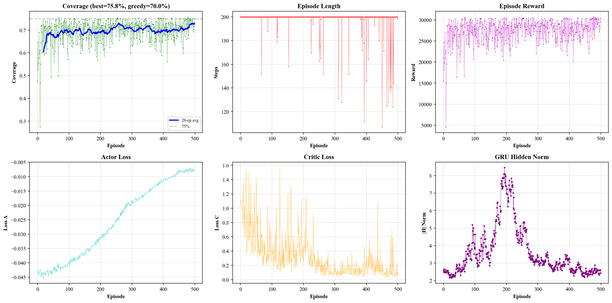
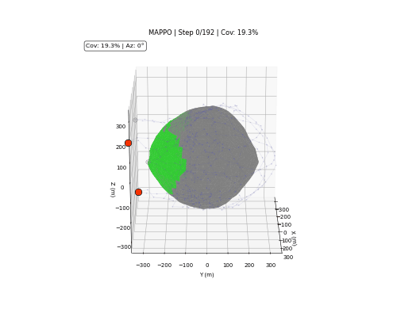

# DRL Surface Detection — MAPPO for Multi-MDU Cooperative Coverage

Deep Reinforcement Learning (MAPPO) for cooperative path planning of multiple
**Movable Detection Units (MDUs)** traversing a space net enveloping asteroid
Bennu. Each MDU carries an 80° conical FOV sensor. Goal: maximize surface
coverage with minimal scan time.

## Architecture

```
src/
├── config.py               # Single source of truth for ALL parameters
├── run_manager.py           # Unified output path management
├── env/
│   ├── asteroid.py          # Bennu polyhedron mesh + cone FOV detection
│   ├── net_graph.py         # Space net topology (369 nodes / 432 edges)
│   └── mdu_coverage_env.py  # Gymnasium Env: reset / step / obs / reward
├── agents/
│   └── mappo.py             # MAPPO + GRU Actor + Critic + BPTT
├── train.py                 # Main training script
├── generate_trajectory.py   # Trajectory generation from checkpoint
└── visualize_trajectory.py  # Animation rendering → GIF
```

**Algorithm**: Multi-Agent PPO (MAPPO) with CTDE (Centralized Training,
Decentralized Execution), GRU temporal memory, truncated BPTT, GAE,
and a Gompertz S-curve coverage bonus.

## Demo

### Training Curves


### 4-MDU Trajectory Animation


## Quick Start

```bash
# Environment
conda activate comm_python_env
set KMP_DUPLICATE_LIB_OK=TRUE

# Train (4 MDUs, all defaults from src/config.py)
python src/train.py --mdus 4 --episodes 500 --save-plot --tag my_run

# Generate trajectory from checkpoint
python src/generate_trajectory.py --mode mappo --tag my_run

# Render animation
python src/visualize_trajectory.py --tag my_run
```

Output goes to `results/<timestamp>_my_run/` containing checkpoints, plots,
trajectories (NPZ + TXT), and animations (GIF).

## Key Results (v14, 500 episodes)

| Metric | Value |
|--------|-------|
| Best Coverage | 75.82% |
| Greedy Coverage | 70.02% |
| Random Baseline | ~53% |
| GRU Hidden Norm | 2.5 → 7.4 (peak) |

## Dependencies

- PyTorch 2.9+ with CUDA
- NumPy, Matplotlib, Gymnasium
- Python 3.11+

## Data Files

- `FNS_square_fold-50m.txt` — space net topology
- `Solution.dat` — final net state after asteroid capture
- `polyhedron_bennu.txt` — Bennu mesh (1348 vertices, 2692 faces)

## License

MIT
